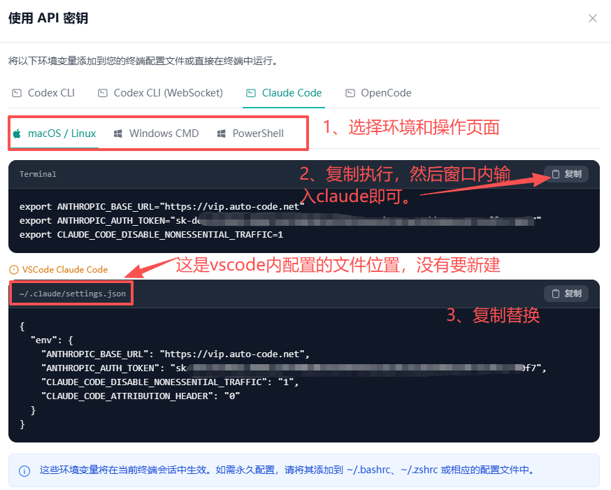

# Claude Code 配置教程

源页面：`/claude-code-guide`

对应文件：`frontend/src/views/public/client-guides/ClaudeCodeGuideContent.vue`

公共外壳：`frontend/src/views/public/ClientGuideView.vue`

图片目录：`../../frontend/public/img/codex-guide/`

## 页面头部信息

API base_url：`https://api.sakms.top/`

页面标题：Claude Code 配置教程

引导文案：

从注册中转账户、兑换额度、创建 API Key，到通过 settings.json 或系统环境变量手动接入 Claude Code。

教程要点：

- 注册中转
- 兑换额度
- 手动配置
- `claude` 验证

章节快捷入口：

- 从零开始：`#claudeStart`
- 手动配置：`#claudeManual`
- 验证排错：`#claudeVerify`

## Claude Code 完整接入流程

### 开始前准备

先准备好两项信息：在中转站创建自己的 API Key，并以“使用密钥”弹窗里 Claude Code 对应配置为准。教程截图和示例里的密钥都不能直接复制。

### 1. 从第一步开始：注册、兑换、创建 Key

1. 打开 [中转注册页](https://api.sakms.top/register)，填写邮箱、验证码和密码，完成中转账户注册。
2. 如果还没有权益，先通过卡密自助购买地址 <https://pay.ldxp.cn/shop/LSSZLMUY> 购买额度包，或使用已发放的质保补发兑换码。
3. 登录后进入兑换页面，输入中转兑换码或额度包兑换码并兑换；随后打开 [额度查询页](https://api.sakms.top/profile) 确认权益到账。
4. 进入 [API 密钥页面](https://api.sakms.top/keys)，点击“创建密钥”，按来源选择正确分组：质保补发码选“质保补偿”，链动小铺额度包选 GPT / GPT-Plus。
5. 创建成功后点击“使用密钥”，切到 Claude Code 配置区域，复制弹窗里的真实 `base_url` 和 `api_key`。



图：Claude Code 配置示例，截图中的 API Key 已脱敏。请以自己的“使用密钥”弹窗为准。

### 2. 手动配置 Claude Code

按“使用密钥”弹窗中的 Claude Code 配置，手动写入环境变量。Claude Code 支持在 `settings.json` 里通过 `env` 为每次会话注入变量；也可以直接写到系统环境变量中。

#### 2.1 定位 Claude 配置目录

| 系统 | 配置目录 | 打开方式 |
| --- | --- | --- |
| **Windows** | `%userprofile%\.claude` | 按 `Win` + `R`，输入 `%userprofile%\.claude` 并回车；目录不存在时可手动新建。 |
| **macOS** | `~/.claude` | 终端执行 `mkdir -p ~/.claude && open ~/.claude`。 |
| **Linux** | `~/.claude` | 终端执行 `mkdir -p ~/.claude && cd ~/.claude`。 |

#### 2.2 方式 A：写入 `settings.json`（推荐）

在 `~/.claude/settings.json` 中写入下面结构。`ANTHROPIC_BASE_URL` 和 `ANTHROPIC_AUTH_TOKEN` 请复制“使用密钥”弹窗里的真实值；如果弹窗给出的地址带 `/v1`，就照弹窗填写。

```json
{
  "env": {
    "ANTHROPIC_BASE_URL": "https://api.sakms.top",
    "ANTHROPIC_AUTH_TOKEN": "填写你的 API 密钥",
    "ANTHROPIC_MODEL": "gpt-5.5"
  }
}
```

提示：如果文件里已经有其他设置，只新增或合并 `env` 字段，不要覆盖原有 `permissions`、`hooks` 等配置。

#### 2.3 方式 B：配置系统环境变量

| 系统 | 设置方法 |
| --- | --- |
| **Windows PowerShell** | `setx ANTHROPIC_BASE_URL "https://api.sakms.top"`<br>`setx ANTHROPIC_AUTH_TOKEN "填写你的 API 密钥"` |
| **macOS / zsh** | 在 `~/.zshrc` 末尾追加 `export ANTHROPIC_BASE_URL="https://api.sakms.top"` 和 `export ANTHROPIC_AUTH_TOKEN="填写你的 API 密钥"`，保存后执行 `source ~/.zshrc`。 |
| **Linux** | 在 `~/.bashrc` 或 `~/.zshrc` 追加同样的 `export` 语句，再重新打开终端。 |

### 3. 验证与排错

- 打开新终端窗口，输入 `claude`，能进入交互并发起一次对话即配置成功。
- 如果提示认证失败，回到中转站重新复制 Claude Code 配置，并确认没有复制教程截图里的脱敏密钥。
- 如果配置后仍无效，先退出 Claude Code，再关闭旧终端，重新打开终端后再次输入 `claude`。
- 如果提示额度或限流，打开 [额度查询页](https://api.sakms.top/profile) 检查余额、订阅日额度和分组是否正确。
