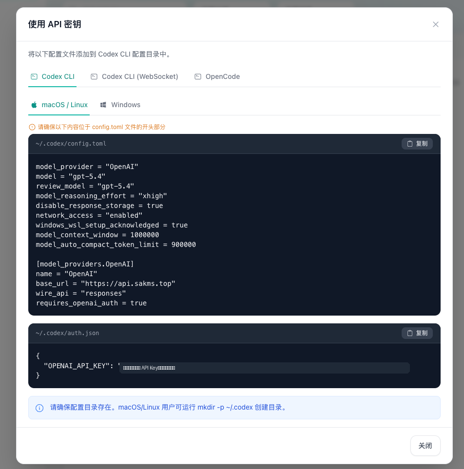
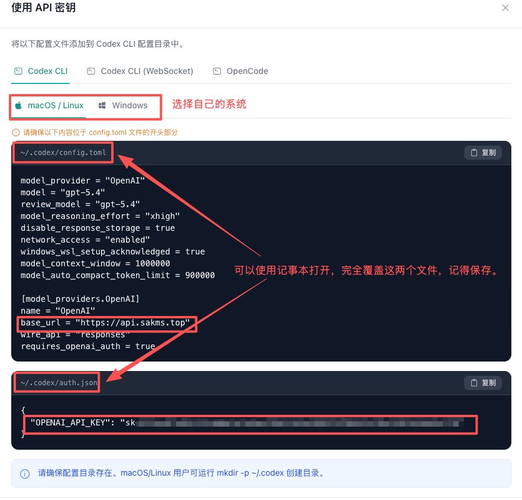

# Codex API 登录对接教程

源页面：`/codex-guide`

对应文件：`frontend/src/views/public/CodexGuideView.vue`

图片目录：`../../frontend/public/img/codex-guide/`

## 页面头部信息

API base_url：`https://sakai.my/`

页面标题：兑换中转 API Key，并接入 Codex

引导文案：

从注册中转账户、兑换中转码、创建 API 密钥，到手动接入 Codex 和常见排错；Claude Code、Open Code、Open Claw 请打开对应独立教程页，移动端请查看 Chatbox 教程。

教程要点：

- 先兑换中转码
- 生成 API Key
- 手动配置 Codex
- 移动端 Chatbox

章节快捷入口：

- 准备：`#chapterPrepare`
- 拿 Key：`#chapterKey`
- 手动配置：`#installCodex`
- 验证排错：`#chapterTrouble`

客户端配置教程互跳入口：

| 标题 | 链接 | 描述 |
| --- | --- | --- |
| Codex 配置教程 | `/codex-guide` | `config.toml / auth.json / API 登录` |
| Claude Code 配置教程 | `/claude-code-guide` | `settings.json / 环境变量 / CLI 验证` |
| Open Code 配置教程 | `/open-code-guide` | `opencode.json / /connect 临时切换` |
| Open Claw 配置教程 | `/open-claw-guide` | `腾讯云在线配置 / 本地配置` |
| 移动端配置教程 | `/mobile-guide` | `Chatbox / 手机配置 / 模型切换` |

## 站点信息卡

| 项目 | 内容 |
| --- | --- |
| 中转注册页 | <https://sakai.my/register> |
| 个人资料额度查询页 | <https://sakai.my/profile> |
| 卡密自助购买地址 | <https://pay.ldxp.cn/shop/LSSZLMUY> |
| 推荐客户端 | 可手动接入 Codex APP / Codex CLI / Codex VSCode 插件。Claude Code、Open Code、Open Claw 请打开对应独立教程页。 |
| 订阅模式 | 每天有一定额度，每天 0 点后自动刷新。 |
| 额度模式 | 使用时消耗网站账户里的额度，用完就没有了。 |

## 阅读指南

本教程把使用流程拆成 **「准备 -> 拿 Key -> 手动配置 -> 验证」** 四步。无论是通过质保兑换补发的中转兑换码，还是在链动小铺上面购买的额度包兑换码，都适用以下教程。

| 你的身份 | 阅读路径 |
| --- | --- |
| 第一次使用，从零开始 | 第一章 -> 第二章 -> 第三章手动配置 -> 第四章 |
| 已有中转账号，只想配置某个客户端 | 第二章 -> 第三章；需要手动配置或接入 Claude Code / Open Code / Open Claw 时再打开对应小节或独立教程 |
| 配置后登录失败或限额 | 第四章验证与排错 |

提示：名词速懂

- **base_url：**中转站的前台地址，告诉客户端去哪请求 AI；本教程默认使用 `https://sakai.my/`，部分 OpenAI-compatible 客户端需要按弹窗填写 `/v1` 后缀。
- **api_key：**你的“门票”，形如 `sk-xxxx`，用于区分用户与记录消费；不能泄露，不要发给他人，泄露等于钱包给别人。
- **sub2api：**把订阅式服务转换为可被代码或客户端调用的 API，本教程中的中转兑换码和订阅权益都可理解为这个接入链路的一部分。

## 第一章 准备工作

### 1.1 使用前说明

Codex App 是 GPT 官方推出的强大软件，具备网页版的核心能力，并且在本地客户端中提供更强的使用体验。

提示：兑换码来源都适用。

本教程同时适用于按邮箱质保剩余时间补发的中转兑换码，也就是质保补发的中转兑换码，以及在链动小铺购买的额度包兑换码。

API Key 分组选择规则：

- **链动小铺额度包：必须选择 GPT 分组**
  链动小铺购买的额度包（不限时），新建 API Key 时必须选择 `GPT` 分组。
- **链动小铺订阅包：选择对应订阅分组**
  链动小铺购买的订阅包（不限时），新建 API Key 时选择你购买相应的额度分组。
- **质保补发码：选择质保补偿**
  通过质保网站补发的中转兑换码，在新建 API Key 时选择“质保补偿”分组。

计费模式提醒：

- **订阅模式**：每天有一定额度，每天 0 点后自动刷新。
- **额度模式**：使用时消耗网站账户里的额度，用完就没有了。

需要额外购买卡密？

可通过链动小铺自助购买额度包兑换码。

卡密自助购买地址：<https://pay.ldxp.cn/shop/LSSZLMUY>


图：有任何问题请扫码加群，联系群主处理。

### 1.2 注册中转账户

**操作步骤：**浏览器打开中转注册链接，填写邮箱、获取验证码、设置密码后完成注册；也就是填写验证码后完成创建中转账户。

注册链接：<https://sakai.my/register>


图 1：注册页面，输入邮箱、密码和验证码后创建账户。

### 1.3 充值与订阅

如果账号内还没有可用权益，可通过站内充值 / 订阅、卡密自助购买，或兑换已发放的中转兑换码获得额度。

- **充值模式：**按金额充值，按调用量从余额中扣费。
- **订阅模式：**按天 / 月 / 季 / 年等周期提供固定额度，更适合稳定使用。
- **倍率与套餐：**不同站点、不同分组可能不同，具体以中转后台实时显示为准。

注意：充值、订阅和兑换码都是权益来源；创建 API Key 时仍然要按“质保补偿 / GPT / 订阅分组”等选择规则来绑定正确权益。

### 1.4 兑换中转码

登录后进入兑换页面 <https://sakai.my/redeem>，输入提供给你的中转兑换码或额度包兑换码，点击“兑换”。


图 2：兑换成功后，账户会获得对应余额或权益。


图 3：兑换记录会出现在最近活动中，可用于确认权益是否到账。

## 第二章 创建 API 密钥（所有接入方式通用）

重要：本章是所有客户端的前置步骤。无论后面要接 Codex、Claude Code、Open Code 还是 Open Claw，都要先在这里拿到一把自己的 API Key。

### 2.1 创建新密钥并选择正确分组

登录后进入 [API 密钥页面](https://sakai.my/keys)，点击“创建密钥”。名称可按自己需要随便填写，也建议按用途命名，例如 `codex`、`claude-mac`、`opencode-win`，方便后续区分和单独吊销。

创建密钥计费模式提醒：

- **订阅类分组：质保补偿 / 订阅\*\***
  “质保补偿”和“订阅**”是订阅制度，不需要消耗余额；质保网站补发的中转码选“质保补偿”。
- **额度类分组：GPT**
  链动小铺购买余额包或额度包时，应选择 `GPT` 分组。创建密钥前请再次确认自己使用的是订阅还是额度。
- **订阅类购买：对应订阅分组**
  链动小铺购买订阅包时，选择你购买相应的订阅额度分组。

重要：分组选错会导致无法使用。分组决定密钥使用的权益来源，请先判断兑换码来源，再选择对应分组。

API 密钥创建步骤：

1. 创建密钥
   进入“API 密钥”页面，点击“创建密钥”。

   

   图 4：如果列表为空，直接点击页面中的“创建密钥”。

2. 选择分组
   质保网站补发的兑换码选“质保补偿”；链动小铺额度兑换码选“GPT”或订阅分组。

   

   图 5：分组决定密钥使用的权益来源，选错会影响后续可用额度。

3. 使用密钥
   创建后回到密钥列表，点击“使用密钥”。

   

   图 6：进入弹窗后，复制自己的 Codex 配置内容。

### 2.2 一键查看接入配置，为后续配置做准备，继续往下滑

密钥创建成功后，在密钥列表的操作列点击“使用密钥”，会弹出接入配置。参考页中会直接给出 Codex CLI、Open Code、Claude Code 等客户端的现成配置；本页也按这些客户端补齐了手动配置方法。

重点提示：Codex VSCode 插件、Codex APP 与 Codex CLI 配置完全相同，通常只填一次。弹窗里的配置已经把 `base_url` 和 `api_key` 填好，优先复制弹窗，不要手动拼错。



图 7：不要复制教程截图中的示例密钥，请使用你自己页面中生成的 API Key。

## 第三章 Codex 客户端接入

说明：本章使用手动修改 `config.toml` / `auth.json` 的方式接入 Codex。Claude Code、Open Code、Open Claw 已拆成独立静态教程页，移动端请查看 Chatbox 教程；配置前仍需先完成第二章创建 API Key。

适用范围：**Codex CLI、Codex VSCode 插件、Codex APP**，三者共用同一份 `.codex` 配置。

重要：下载好后必须先打开一次 Codex。先打开 Codex 初始化配置文件，然后再完全关闭 Codex，继续下一步文件配置。

Codex 下载页：<https://openai.com/zh-Hans-CN/codex/>


图 8：点击页面中的下载入口获取 Codex。

### 3.1 手动配置 Codex 系列

按第二章“使用密钥”弹窗中的 Codex CLI 接入配置，手动修改 `config.toml` / `auth.json`。手动配置适用于 **Codex CLI、Codex VSCode 插件、Codex APP**。

重要：配置文件前必须退出登录并完全关闭 Codex。请确保 Codex 进程没有在运行，再编辑 `config.toml` 和 `auth.json`，否则配置可能不会生效。

#### Windows

1. 首先要保证 Codex 已经下载好，配置文件前必须退出登录并完全关闭 Codex。请确保 Codex 进程没有在运行。
2. 然后在 C 盘找到用户文件夹，在显示中点击显示隐藏文件。
3. 在用户文件夹打开某一用户文件夹，寻找 `.codex` 文件夹；如果没有找到，就换一个用户文件夹。
4. 打开 `.codex` 文件夹之后，如果有 `config.toml` 和 `auth.json` 这两个配置文件，直接改动即可；如果没有就新建，文件名就是 `config.toml` 和 `auth.json`。

如果是新手，直接按下面图片教程替换这两个文件就行了。



图 9：配置示例，截图中的 API Key 已脱敏。请使用你自己的密钥，不要复制教程截图。

#### Mac

1. 在磁盘用户目录中找到 `.codex` 文件夹，如果找不到就按 `Command` + `Shift` + `.` 显示隐藏文件。
2. 确认存在 `config.toml` 和 `auth.json`，如果没有就新建。文件名就是 `config.toml` 和 `auth.json`。


图 10：Mac 在用户目录中找到 `.codex`。


图 11：确认存在 `config.toml` 和 `auth.json`。

如果是新手，直接按下面图片教程替换这两个文件就行了。


图 12：配置示例，截图中的 API Key 已脱敏。请使用你自己的密钥，不要复制教程截图。

### 3.2 其他客户端独立教程

以下客户端配置已经从 Codex 主教程中单独拆出，方便直接分享给不同用户。打开对应页面后，仍然以第二章“使用密钥”弹窗里的真实 `base_url` 和 `api_key` 为准。

| 标题 | 链接 | 描述 |
| --- | --- | --- |
| Claude Code 配置教程 | `/claude-code-guide` | 环境变量 / settings.json / CLI 验证 |
| Open Code 配置教程 | `/open-code-guide` | opencode.json / /connect 临时切换 |
| Open Claw 配置教程 | `/open-claw-guide` | 腾讯云在线配置 / 本地配置 |
| 移动端配置教程 | `/mobile-guide` | Chatbox / 手机配置 / 模型切换 |

### 3.3 重新打开 Codex 并使用 API 登录

完成文件配置后重新打开 Codex，选择“换种方式登录”，再选择 API 登录并粘贴自己的 API 密钥。API 密钥从 <https://sakai.my/keys> 获取。


图 13：选择“换种方式登录”。


图 14：选择 API 登录并粘贴密钥。


图 15：从中转后台复制你自己的 API Key。

## 第四章 验证与排错

### 4.1 一行命令自检（推荐）

复制下方命令到终端，把 `sk-xxxx` 换成你的真实密钥。如果能返回模型清单，说明 Key 与 base_url 基本正常。

```bash
curl https://sakai.my/v1/models \
  -H "Authorization: Bearer sk-xxxx"
```

- **Windows PowerShell** 用户请把 `\` 续行符换成反引号 `` ` ``，或直接写成单行。
- 如果你的“使用密钥”弹窗显示的 base_url 不是 `/v1` 结尾，请以弹窗为准调整命令。

### 4.2 登录失败时快速检查

- 编辑配置前是否已经完全关闭 Codex？
- `config.toml` 和 `auth.json` 是否放在同一个 `.codex` 目录？
- 是否粘贴了你自己生成的 API Key，而不是教程截图中的示例？
- 创建密钥时是否按来源选择正确分组：质保网站补发的中转码选“质保补偿”，链动小铺额度兑换码选“GPT”或订阅分组？

### 4.3 常见报错对照表

| 报错 / 现象 | 原因 | 处理方式 |
| --- | --- | --- |
| `401 Unauthorized` / Incorrect API key | 密钥错、被删，或配置时 Codex 已经在运行。 | 关闭 Codex，回第二章重新创建或复制密钥，再重新配置 `config.toml` 并登录。 |
| `404 Not Found` | `base_url` 写错，或客户端需要 `/v1` 但未填写。 | 检查是否与“使用密钥”弹窗一致；OpenAI-compatible 客户端通常使用 `https://sakai.my/v1`。 |
| `余额不足` / `quota exceeded` / `429 Too Many Requests` | 充值未到账、额度用完、订阅日额度耗尽或触发频率限制。 | [打开额度查询页面](https://sakai.my/profile) 查看余额和额度；必要时等待刷新或补充额度。 |
| `model not found` | 模型 ID 拼错，或当前分组不支持该模型。 | 用 4.1 的 curl 命令查看模型清单，或按中转后台可用模型重新填写。 |
| 客户端启动后无反应 | 环境变量未生效，旧终端还在使用旧配置。 | 关闭并新开一个终端窗口，再启动 `codex` / `claude` / `opencode`。 |
| `config.toml.txt` / `opencode.json.txt` | Windows 默认隐藏文件后缀，实际创建成了文本文件。 | 资源管理器 -> 查看 -> 勾选“文件扩展名”，再把文件名改正确。 |
| 原 Codex 聊天记录不见 | 切换 API 中转后，本地 provider 不一致。 | 参考 [codex-provider-sync releases](https://github.com/Dailin521/codex-provider-sync/releases) 恢复。 |


图 16：错误示例，API Key 片段已脱敏。

## 第五章 FAQ

**Q1：一个账号能创建几把密钥？**

可创建多把，建议按客户端 / 设备分别命名，便于审计和单独吊销。

**Q2：泄露密钥怎么办？**

立即在“API 密钥”页面删除原密钥，重新创建一把，然后更新所有客户端的配置。

**Q3：Codex / Claude Code / Open Code 可以共用一把密钥吗？**

可以，但不建议。多把密钥独立计费、独立吊销，出问题时排查更快；对应配置请打开上方独立教程页。

**Q4：充值的钱和订阅额度怎么消费？**

额度模式按调用量从余额扣款；订阅模式则在订阅周期或每日额度内使用，具体计费规则以中转后台实时显示为准。

**Q5：技术支持怎么联系？**

可查看页面上方交流群二维码，或登录中转站后在个人中心、站内公告、客服入口查看最新联系方式。
