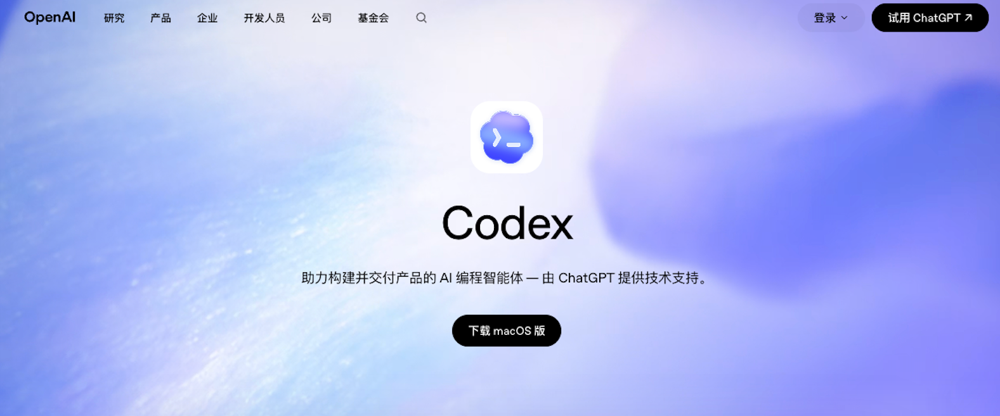
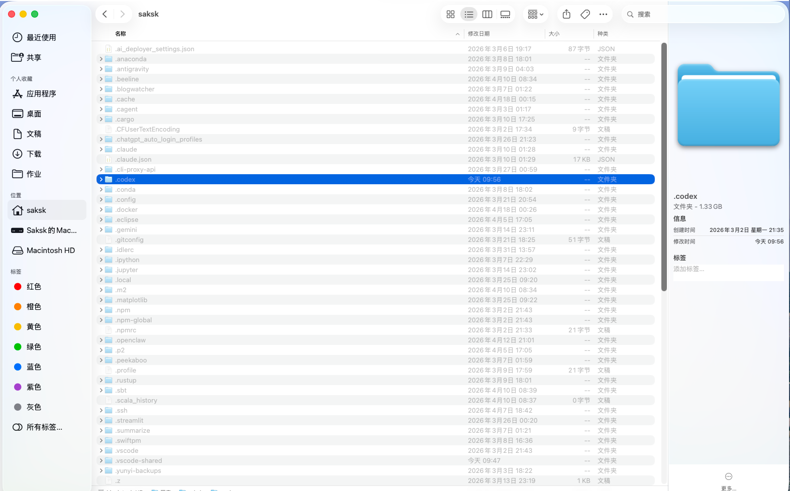
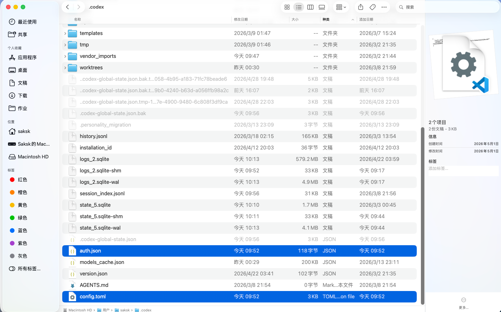
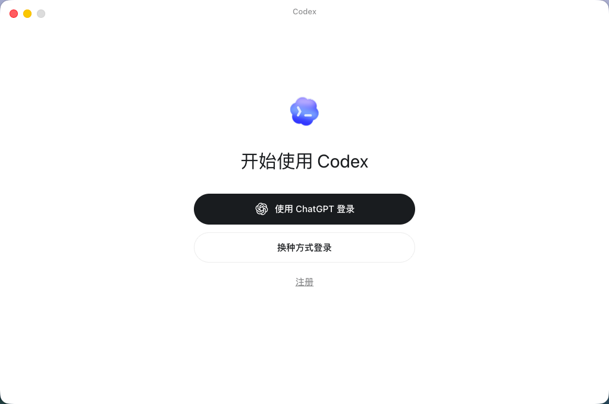
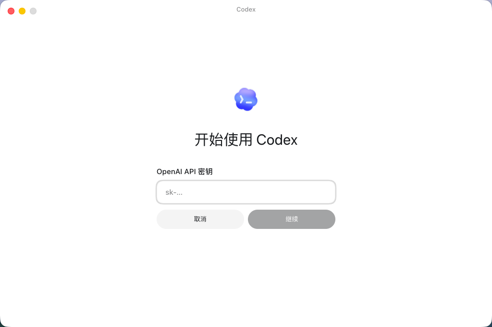
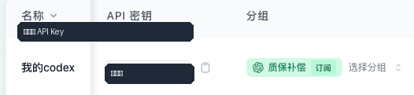
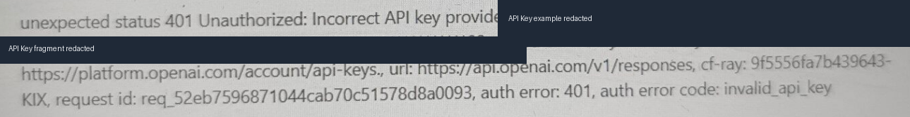

# Codex API 登录对接教程

> API base_url：`https://sakai.my/`

前置步骤：请先完成父教程《中转注册、兑换与 API 密钥配置教程》，准备好自己的 `base_url` 和 API Key。本文只讲客户端配置，不再重复注册、兑换和创建密钥。

## 教程要点

- 下载并初始化 Codex
- 配置 `config.toml` 和 `auth.json`
- 使用 API Key 登录
- 验证配置并排查常见错误

## 开始前准备

在父教程中创建密钥后，点击“使用密钥”，打开 Codex 配置区域。优先复制弹窗中已填好的 `base_url` 和 `api_key`，不要复制教程截图中的脱敏密钥。

## Codex 客户端配置流程

说明：本章使用手动修改 `config.toml` / `auth.json` 的方式接入 Codex。Claude Code、Open Code、Open Claw 已拆成独立教程文档，移动端请查看 Chatbox 教程；配置前请先完成父教程。

适用范围：**Codex CLI、Codex VSCode 插件、Codex APP**，三者共用同一份 `.codex` 配置。

重要：下载好后必须先打开一次 Codex。先打开 Codex 初始化配置文件，然后再完全关闭 Codex，继续下一步文件配置。

Codex 下载页：<https://openai.com/zh-Hans-CN/codex/>



图 1：点击页面中的下载入口获取 Codex。

### 1. 手动配置 Codex 系列

按父教程“使用密钥”弹窗中的 Codex CLI 接入配置，手动修改 `config.toml` / `auth.json`。手动配置适用于 **Codex CLI、Codex VSCode 插件、Codex APP**。

重要：配置文件前必须退出登录并完全关闭 Codex。请确保 Codex 进程没有在运行，再编辑 `config.toml` 和 `auth.json`，否则配置可能不会生效。

#### Windows

1. 首先要保证 Codex 已经下载好，配置文件前必须退出登录并完全关闭 Codex。请确保 Codex 进程没有在运行。
2. 然后在 C 盘找到用户文件夹，在显示中点击显示隐藏文件。
3. 在用户文件夹打开某一用户文件夹，寻找 `.codex` 文件夹；如果没有找到，就换一个用户文件夹。
4. 打开 `.codex` 文件夹之后，如果有 `config.toml` 和 `auth.json` 这两个配置文件，直接改动即可；如果没有就新建，文件名就是 `config.toml` 和 `auth.json`。

如果是新手，直接按下面图片教程替换这两个文件就行了。

#### Mac

1. 在磁盘用户目录中找到 `.codex` 文件夹，如果找不到就按 `Command` + `Shift` + `.` 显示隐藏文件。
2. 确认存在 `config.toml` 和 `auth.json`，如果没有就新建。文件名就是 `config.toml` 和 `auth.json`。



图 2：Mac 在用户目录中找到 `.codex`。



图 3：确认存在 `config.toml` 和 `auth.json`。

如果是新手，直接按下面图片教程替换这两个文件就行了。

### 2. 重新打开 Codex 并使用 API 登录

完成文件配置后重新打开 Codex，选择“换种方式登录”，再选择 API 登录并粘贴自己的 API 密钥。API 密钥从 <https://sakai.my/keys> 获取。



图 4：选择“换种方式登录”。



图 5：选择 API 登录并粘贴密钥。



图 6：从中转后台复制你自己的 API Key。

## 验证与排错

### 1. 一行命令自检（推荐）

复制下方命令到终端，把 `sk-xxxx` 换成你的真实密钥。如果能返回模型清单，说明 Key 与 base_url 基本正常。

```bash
curl https://sakai.my/v1/models \
  -H "Authorization: Bearer sk-xxxx"
```

- **Windows PowerShell** 用户请把 `\` 续行符换成反引号 `` ` ``，或直接写成单行。
- 如果你的“使用密钥”弹窗显示的 base_url 不是 `/v1` 结尾，请以弹窗为准调整命令。

### 2. 登录失败时快速检查

- 编辑配置前是否已经完全关闭 Codex？
- `config.toml` 和 `auth.json` 是否放在同一个 `.codex` 目录？
- 是否粘贴了你自己生成的 API Key，而不是教程截图中的示例？
- 创建密钥时是否按来源选择正确分组：质保网站补发的中转码选“质保补偿”，链动小铺额度兑换码选“GPT”或订阅分组？

### 3. 常见报错对照表

| 报错 / 现象 | 原因 | 处理方式 |
| --- | --- | --- |
| `401 Unauthorized` / Incorrect API key | 密钥错、被删，或配置时 Codex 已经在运行。 | 关闭 Codex，回到父教程重新创建或复制密钥，再重新配置 `config.toml` 并登录。 |
| `404 Not Found` | `base_url` 写错，或客户端需要 `/v1` 但未填写。 | 检查是否与“使用密钥”弹窗一致；OpenAI-compatible 客户端通常使用 `https://sakai.my/v1`。 |
| `余额不足` / `quota exceeded` / `429 Too Many Requests` | 充值未到账、额度用完、订阅日额度耗尽或触发频率限制。 | [打开额度查询页面](https://sakai.my/profile) 查看余额和额度；必要时等待刷新或补充额度。 |
| `model not found` | 模型 ID 拼错，或当前分组不支持该模型。 | 用 4.1 的 curl 命令查看模型清单，或按中转后台可用模型重新填写。 |
| 客户端启动后无反应 | 环境变量未生效，旧终端还在使用旧配置。 | 关闭并新开一个终端窗口，再启动 `codex` / `claude` / `opencode`。 |
| `config.toml.txt` / `opencode.json.txt` | Windows 默认隐藏文件后缀，实际创建成了文本文件。 | 资源管理器 -> 查看 -> 勾选“文件扩展名”，再把文件名改正确。 |
| 原 Codex 聊天记录不见 | 切换 API 中转后，本地 provider 不一致。 | 参考 [codex-provider-sync releases](https://github.com/Dailin521/codex-provider-sync/releases) 恢复。 |



图 7：错误示例，API Key 片段已脱敏。
