# 图像生成教程

源页面：`/image-guide`

对应文件：`frontend/src/views/public/client-guides/ImageGuideContent.vue`

公共外壳：`frontend/src/views/public/ClientGuideView.vue`

图片目录：`../../frontend/public/img/image-guide/`

## 页面头部信息

API base_url：`https://api.sakms.top/`

页面标题：图像生成教程

引导文案：

使用 Cherry Studio 接入 <https://api.sakms.top/>，配置 `gpt-image-2` 图像生成端点，并通过绘画入口完成专业生图。

教程要点：

- 下载 Cherry Studio
- 填写 API Key
- `gpt-image-2`
- 绘画入口验证

章节快捷入口：

- 下载：`#imageDownload`
- 模型服务：`#imageService`
- 配置模型：`#imageModel`
- 开始生图：`#imageGenerate`

## Cherry Studio 图像生成完整配置流程

### 当前图像生成路径说明

当前生图请走 `/imagegen` 路径。除“GPT Image 生图专用”分组外，其他分组暂无法在 Codex 中直接调用 `image2` 生图模型。

建议按本教程配置 Cherry Studio，图像生成流程更专业，也更方便选择模型和管理提示词。

### 1. 下载 Cherry Studio

打开 Cherry Studio 官网 <https://cherryai.com.cn/>，下载并安装适合你系统的版本。

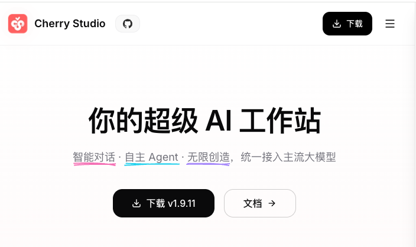

图 1：进入 Cherry Studio 官网下载客户端。

### 2. 配置模型服务

1. 打开 Cherry Studio，点击右上角设置按钮。
2. 在“模型服务”中找到并选择 **New API**。
3. 填写 API 地址和密钥。API 地址填写 `https://api.sakms.top/`，API 密钥填写你自己的中转 API Key。

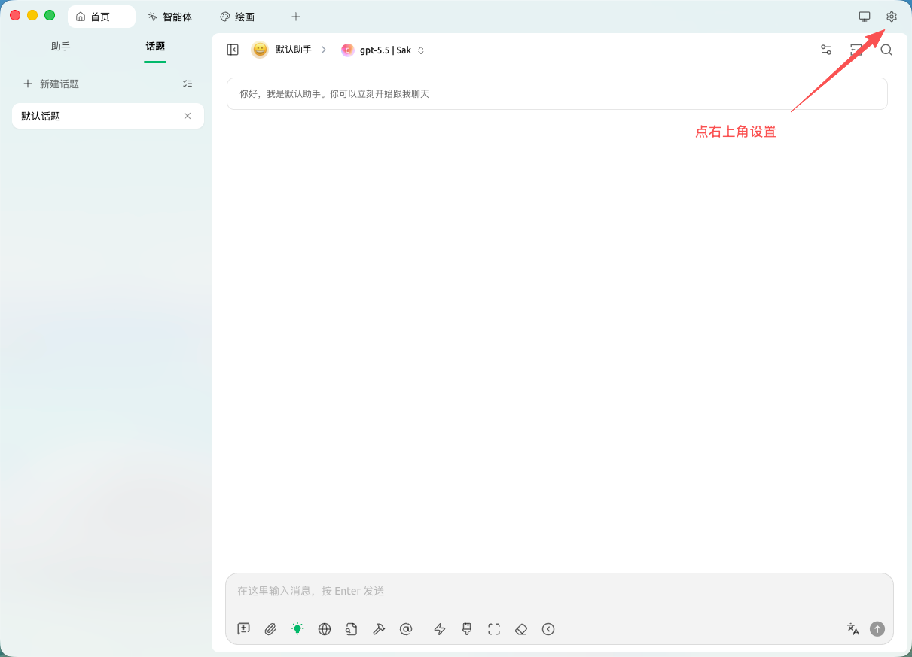

图 2：点击右上角设置按钮。

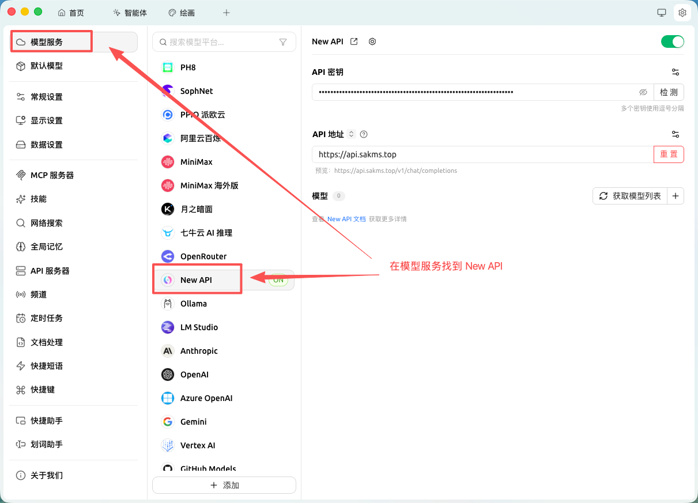

图 3：在模型服务中找到 New API。

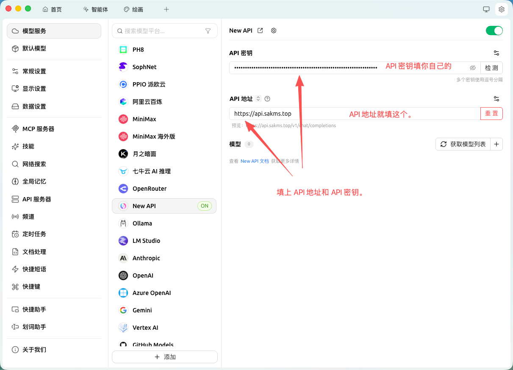

图 4：填写 API 地址和自己的 API 密钥。

填写提醒：API 地址固定填写 `https://api.sakms.top/`。API 密钥请从 [中转后台 API 密钥页面](https://api.sakms.top/keys) 复制自己的 Key，不要复制教程截图。

### 3. 配置图像生成模型

1. 点击“获取模型列表”，拉取当前账号可用模型。
2. 找到 `gpt-image-2`，点击右侧加号添加模型。
3. 在端点类型中选择“图像生成”，然后点击“添加模型”。
4. 返回模型列表，确认 `gpt-image-2` 已经以图像生成端点保存。

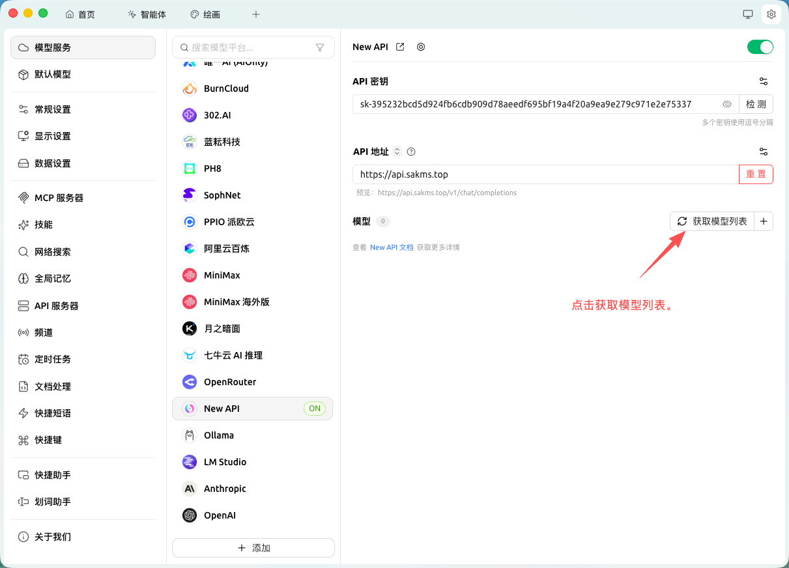

图 5：点击获取模型列表。

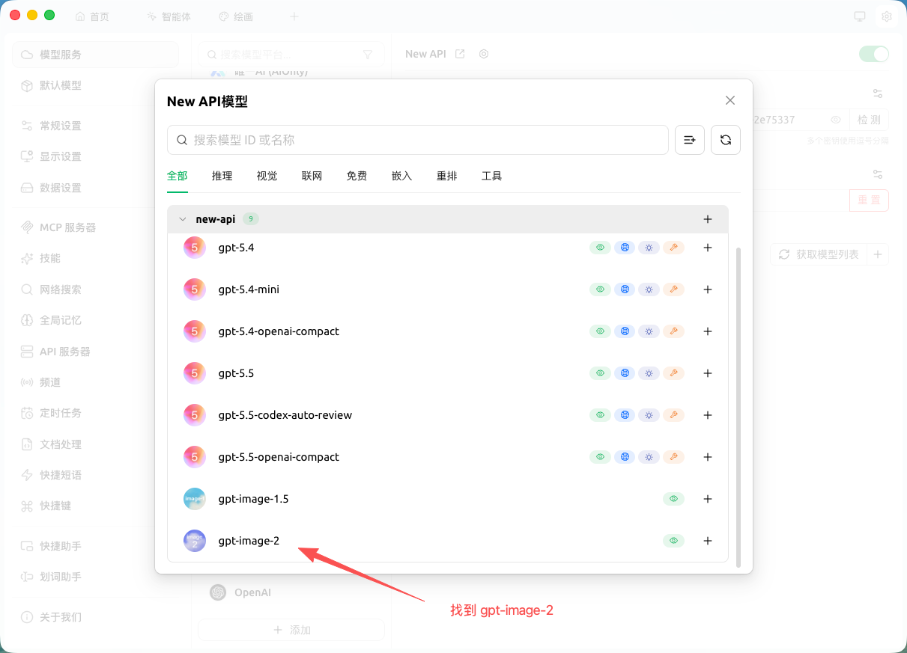

图 6：找到 gpt-image-2 并点击右侧加号。

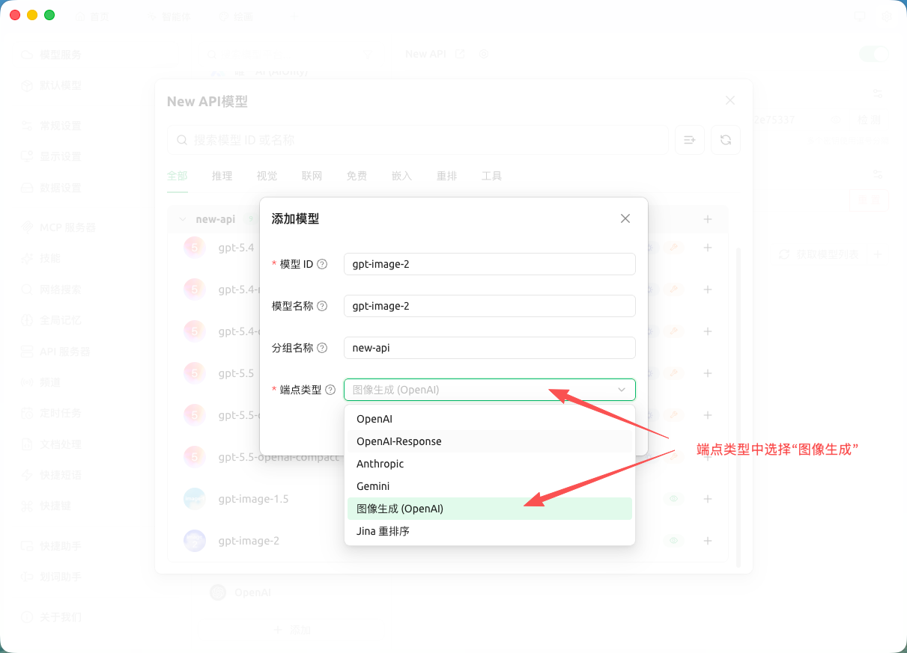

图 7：端点类型选择图像生成后添加模型。

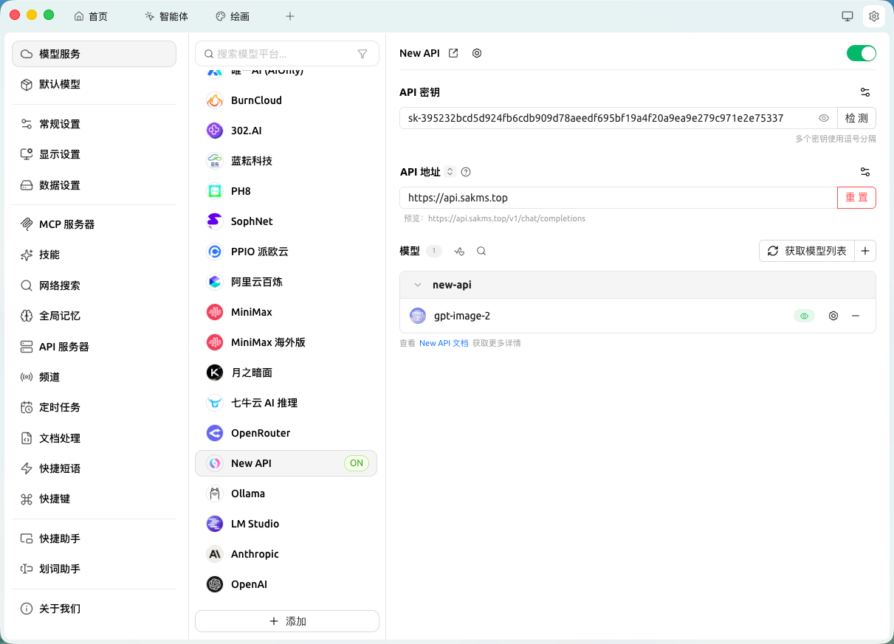

图 8：配置完成后的模型服务状态。

### 4. 开始生图

1. 点击上方加号，新建任务。
2. 选择“绘画”。
3. 选择刚配置的模型提供商和 `gpt-image-2` 模型。
4. 输入提示词并发送，等待图片生成完成。

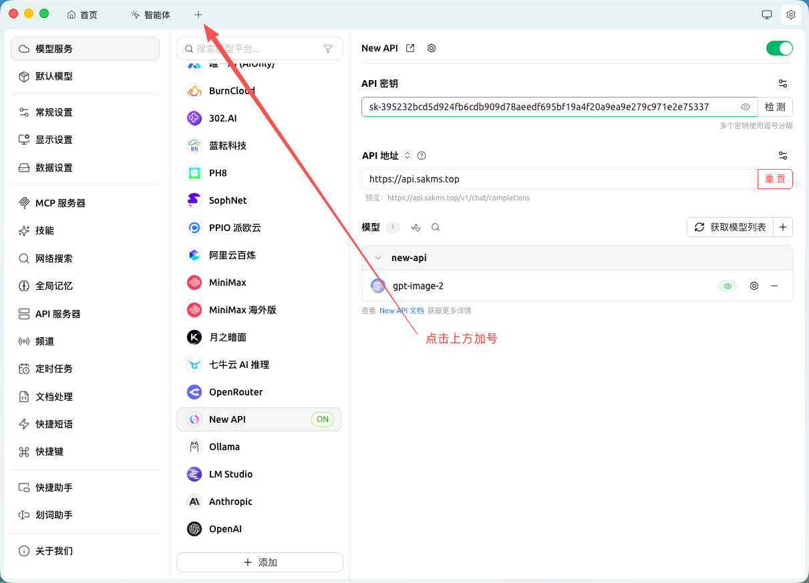

图 9：点击上方加号。

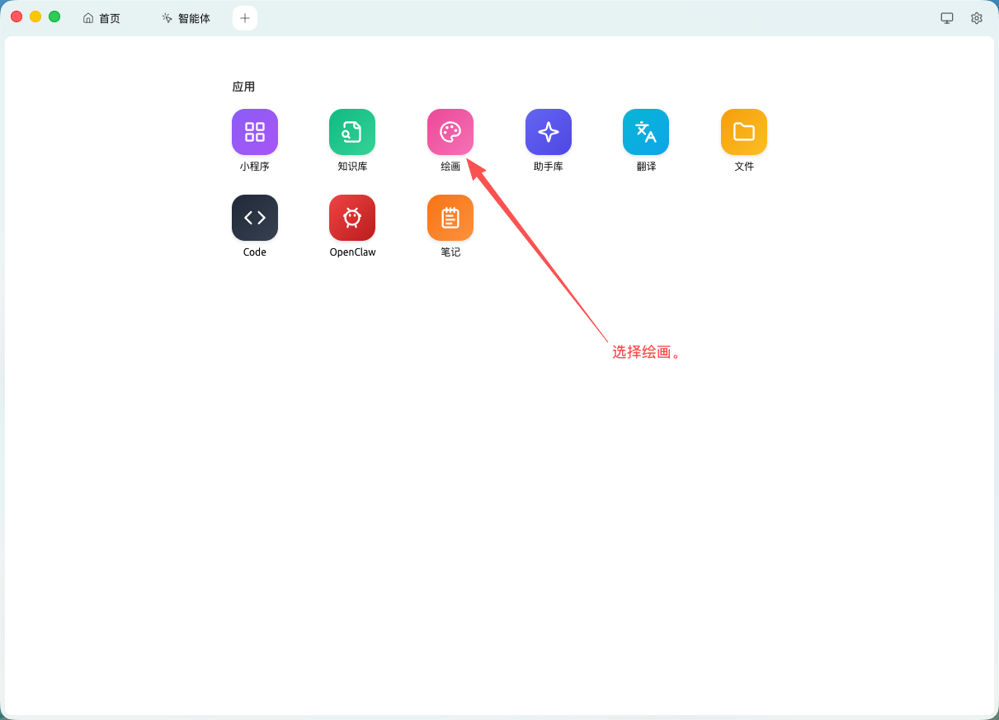

图 10：选择绘画。

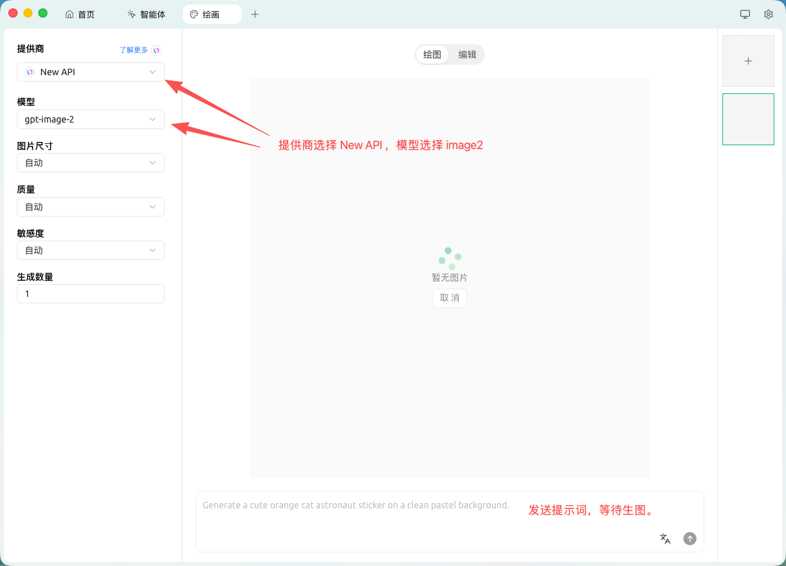

图 11：选择模型提供商和模型后发送提示词。

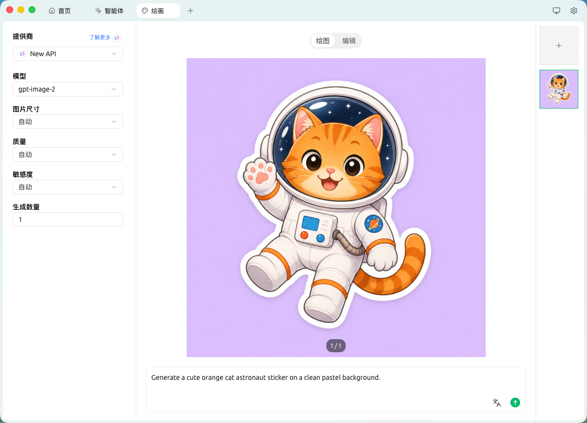

图 12：图片生成成功。

### 5. 完成检查

- 模型服务 API 地址已填写 `https://api.sakms.top/`。
- API 密钥来自你自己的中转后台账号，没有复制教程截图或他人密钥。
- `gpt-image-2` 已添加，并且端点类型为“图像生成”。
- 生图入口选择“绘画”，并在发送前确认模型提供商和模型都已切换到刚配置的服务。
