# 移动端配置教程

源页面：`/mobile-guide`

对应文件：`frontend/src/views/public/client-guides/MobileGuideContent.vue`

公共外壳：`frontend/src/views/public/ClientGuideView.vue`

图片目录：`../../frontend/public/img/codex-guide/`

## 页面头部信息

API base_url：`https://api.sakms.top/`

页面标题：移动端配置教程

引导文案：

使用 Chatbox 在 iOS、Android 等移动设备接入 sak API 服务，从下载应用、添加模型提供方到完成模型选择，按步骤配置即可。

教程要点：

- 下载 Chatbox
- 手机端配置
- OpenAI response API 兼容
- 新对话切换模型

章节快捷入口：

- 下载应用：`#mobileDownload`
- 配置步骤：`#mobileConfig`
- 完成检查：`#mobileCheck`
- 开始使用：`#mobileUse`

## 移动端完整接入流程

### 开始前准备

开始前请先准备自己的 API Key：请先在 [Codex 总教程第二章](/codex-guide#chapterKey) 完成中转账户注册、权益兑换与 API Key 创建，再回到本页做移动端接入。

### 1. 前往官网下载 Chatbox

浏览器打开 Chatbox 官网 <https://chatboxai.app/zh>，选择适配你设备的版本。该应用支持 iOS、Android 等移动端平台。

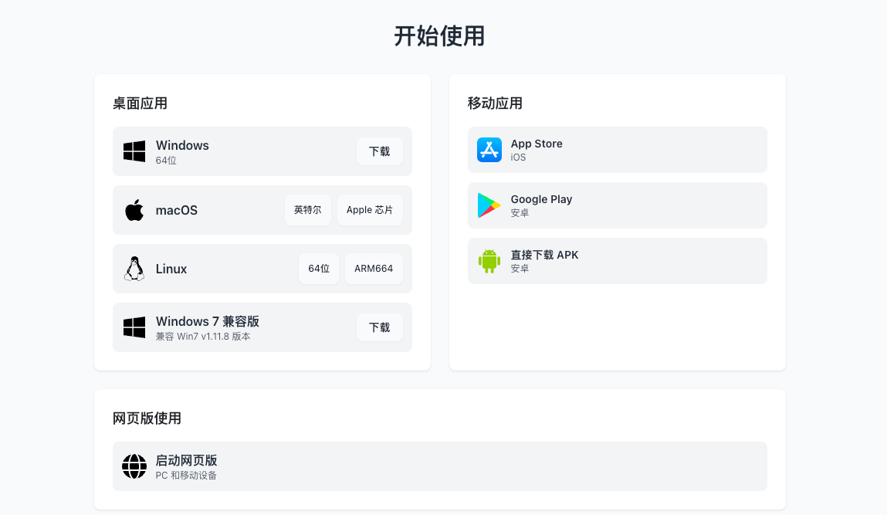

图 1：前往 Chatbox 官网下载移动端应用。

### 2. 确认安装后的应用界面

下载并安装完成后，打开应用，确认界面与下图类似，再开始添加自定义模型提供方。

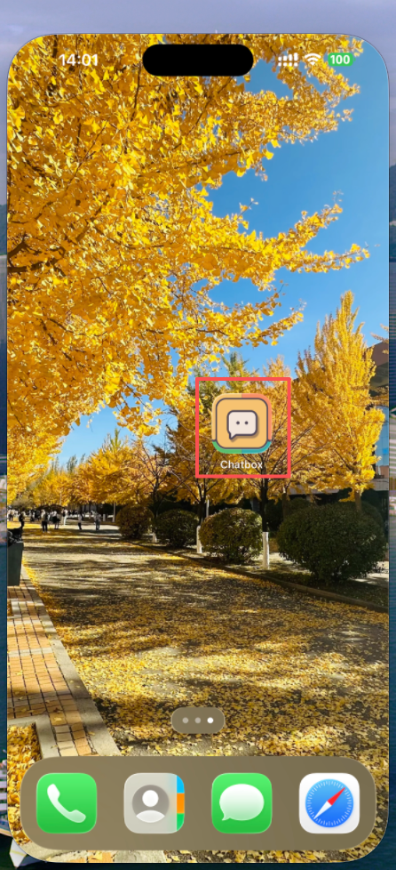

图 2：安装完成后的 Chatbox 首页示意。

### 3. 配置步骤

1. 打开应用后，点击左上角菜单按钮。
2. 进入“设置”。
3. 打开“模型提供方”。
4. 点击“添加”，新建一个自定义提供方。
5. API 模式选择 **OpenAI response API 兼容**。
6. 按下方说明填写 API 主机、API 密钥，并获取模型列表。

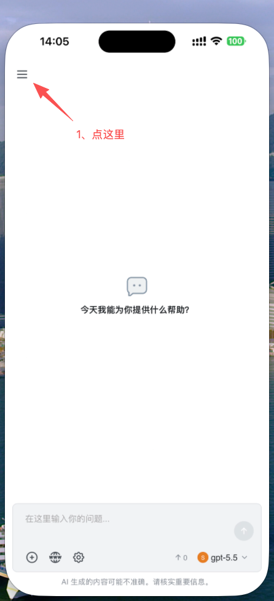

图 3：打开左上角菜单。

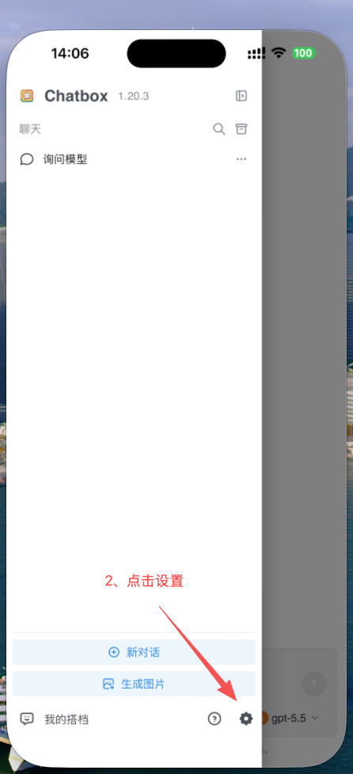

图 4：进入设置页。

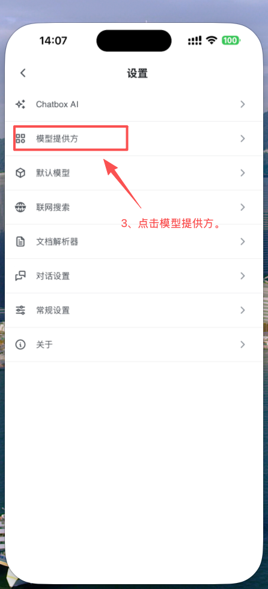

图 5：打开模型提供方配置。

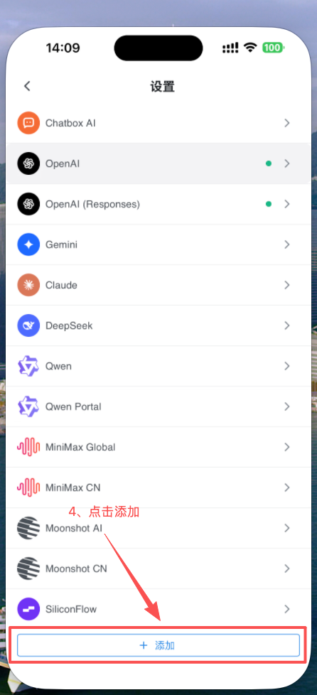

图 6：点击添加。

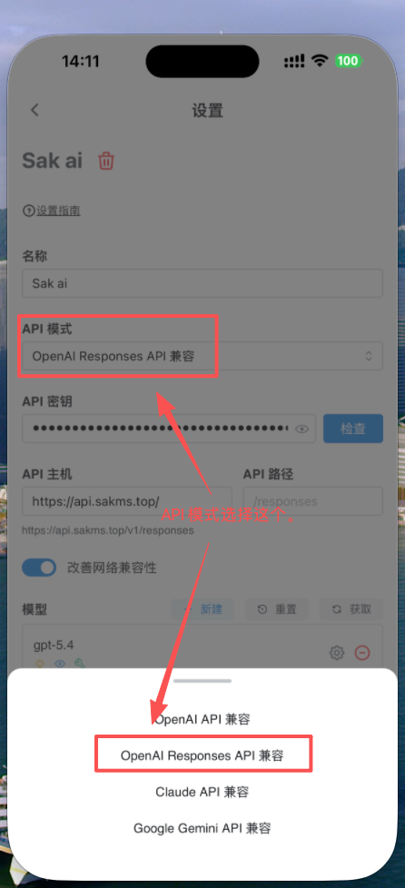

图 7：API 模式选择 OpenAI response API 兼容。

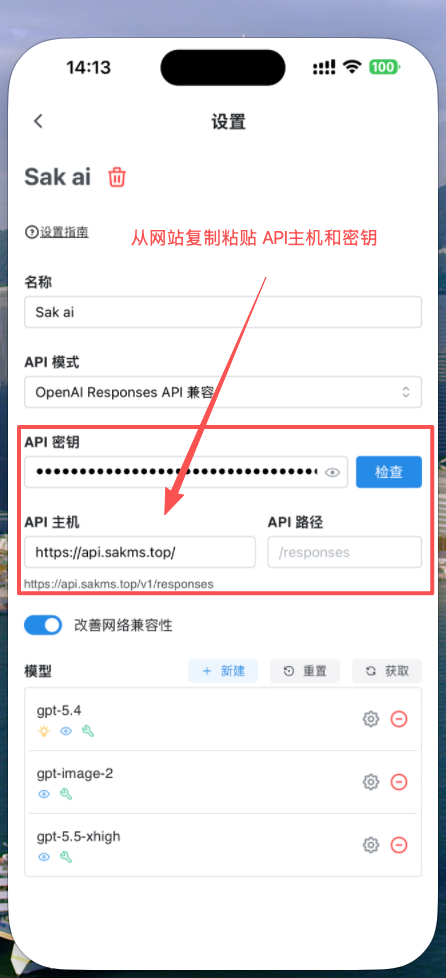

图 8：进入 API 配置页。

填写规则：API 主机填写 `https://api.sakms.top/`；API 密钥请前往 <https://api.sakms.top/keys> 创建并复制你自己的 Key。

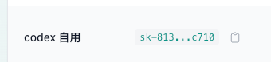

图 9：在中转后台复制自己的 API 密钥后粘贴到移动端配置里。

#### 3.1 获取并选择模型

1. 点击“获取”拉取当前可用模型列表。
2. 在模型列表中点击右侧加号，添加你要使用的主流模型。
3. 回到配置页检查 API 主机、API 密钥和模型是否都已保存。

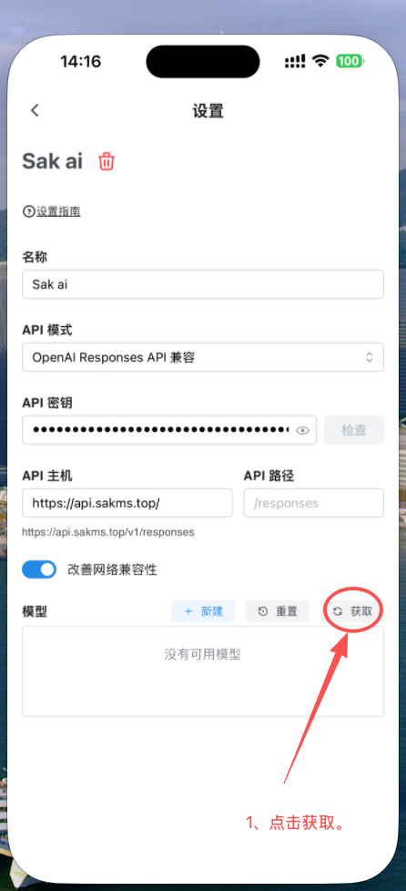

图 10：点击获取模型。

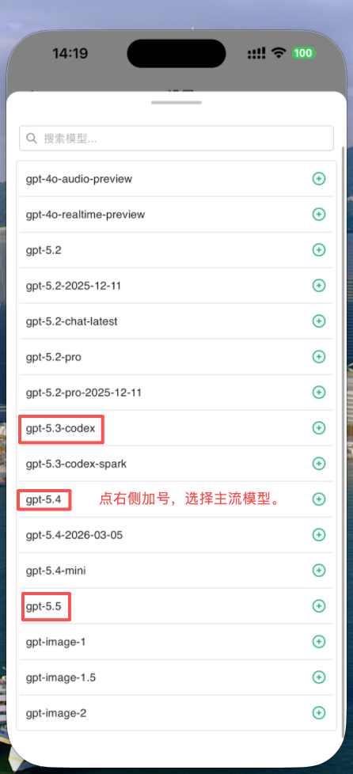

图 11：点击右侧加号添加模型。

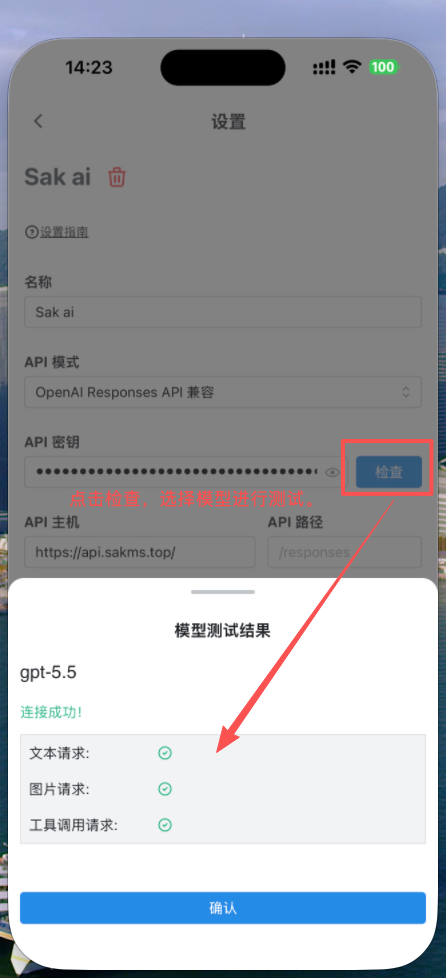

图 12：确认主要配置项都已完成。

### 4. 完成检查

- API 模式已选择 `OpenAI response API 兼容`。
- API 主机已填写 `https://api.sakms.top/`。
- API 密钥来自你自己的 [中转后台](https://api.sakms.top/keys)，不是教程示例。
- 至少已添加一个可用模型，避免新建对话后没有模型可选。

### 5. 开始使用

配置完成后，新建一个对话，在右下角入口中切换到刚添加的模型即可开始使用。

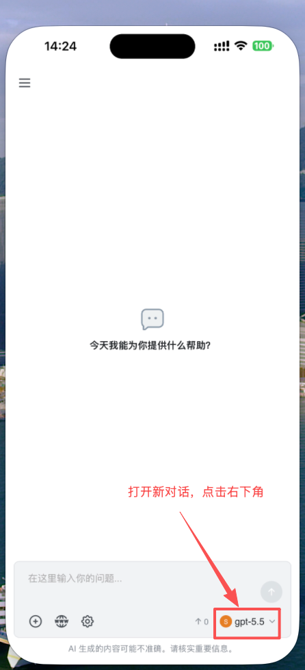

图 13：新建对话后点击右下角模型入口。

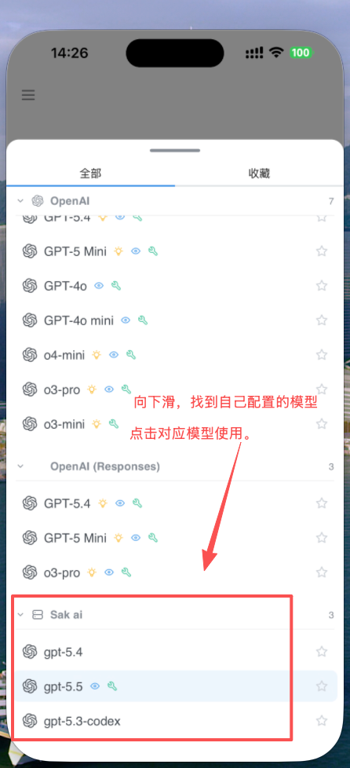

图 14：下滑找到自己配置的模型并点击使用。

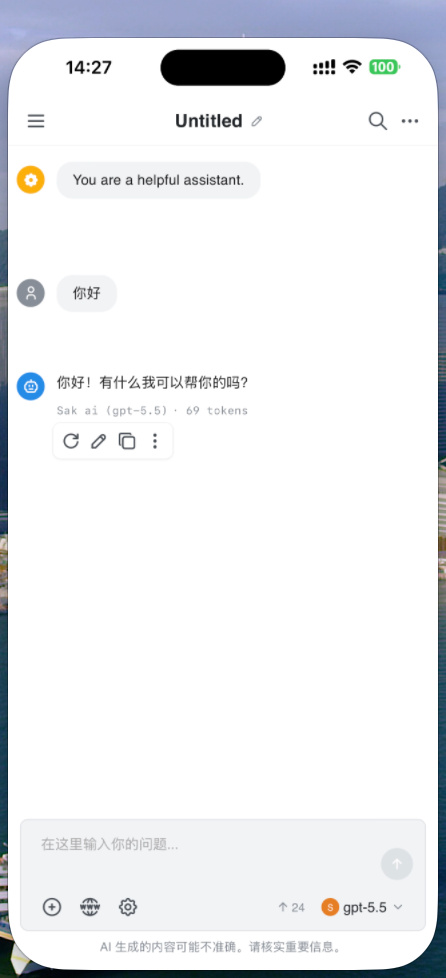

图 15：配置成功后即可正常使用。
