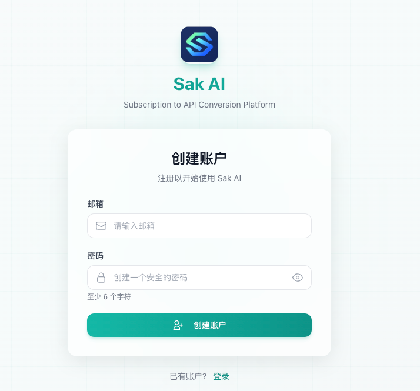
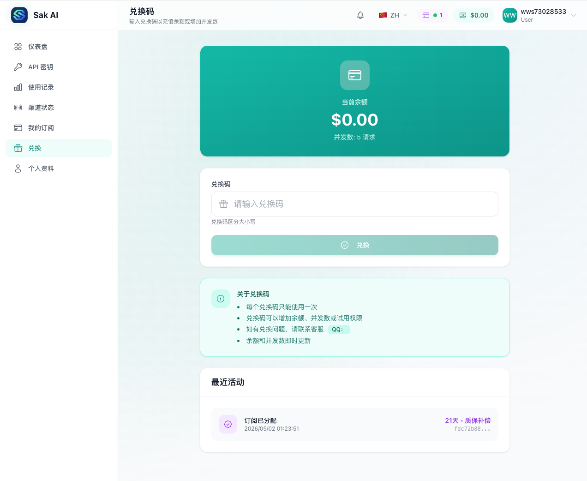
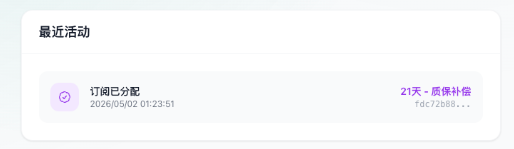
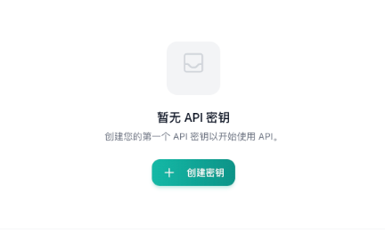
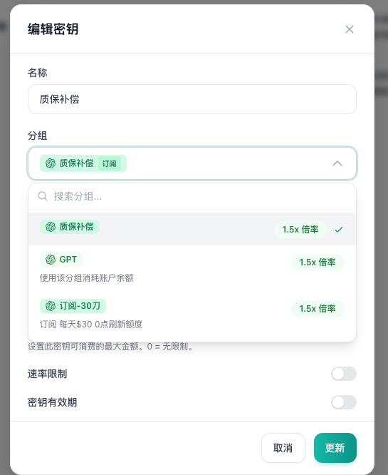
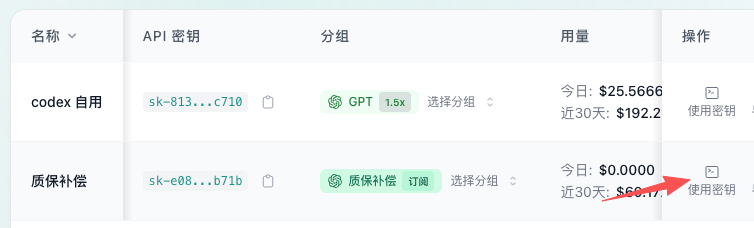

# 中转注册、兑换与 API 密钥配置教程

> API base_url：`https://sakai.my/`

本教程作为所有客户端配置教程的父文档，统一说明中转账户注册、权益兑换、API 密钥创建与分组选择。完成后，再阅读对应的子教程配置具体客户端。

## 教程要点

- 注册中转账户
- 充值或兑换权益
- 创建 API 密钥
- 选择正确分组

## 中转注册、兑换与 API 密钥配置流程

### 一、教程目录关系

本文档是父教程。以下配置文档均作为子教程，不再重复讲解注册、兑换和创建 API 密钥。

| 子教程 | 内容 |
| --- | --- |
| Codex API 登录对接教程 | `config.toml` / `auth.json` / API 登录 |
| Claude Code 配置教程 | `settings.json` / 环境变量 / CLI 验证 |
| Open Code 配置教程 | `opencode.json` / `/connect` |
| Open Claw 配置教程 | 腾讯云在线配置 / 本地配置 |
| 移动端 Chatbox 配置教程 | Chatbox / 手机配置 / 模型切换 |
| Cherry Studio 图像生成教程 | `imagegen` / `gpt-image-2` |

### 二、使用前说明

本教程同时适用于质保补发的中转兑换码、站内充值或订阅，以及在链动小铺购买的额度包或订阅包。

API 密钥分组选择规则：

- **链动小铺额度包：选择 `GPT` 分组**
  额度包使用时从网站账户余额中扣费。
- **链动小铺订阅包：选择对应订阅分组**
  选择与已购买套餐对应的订阅分组。
- **质保补发码：选择“质保补偿”**
  质保网站补发的中转兑换码使用订阅权益，不扣除额度余额。

计费模式提醒：

- **订阅模式：**每天有固定额度，通常在每天 0 点后刷新。
- **额度模式：**调用时按实际消耗从网站账户余额中扣费。

需要额外购买额度包时，可使用链动小铺卡密自助购买地址：<https://catfk.com/shop/92O8CR0C>

图：有任何问题可扫码加群，联系群主处理。

### 三、注册中转账户

1. 浏览器打开中转注册页：<https://sakai.my/register>
2. 填写邮箱、获取验证码并设置密码。
3. 输入验证码后完成账户创建。

图 1：注册页面，输入邮箱、密码和验证码后创建账户。

### 四、获取并兑换权益

账户内还没有可用权益时，可通过站内充值或订阅、卡密自助购买，或兑换已发放的中转兑换码获得权益。

1. 登录后打开兑换页：<https://sakai.my/redeem>
2. 输入中转兑换码或额度包兑换码。
3. 点击“兑换”，并等待成功提示。
4. 打开个人资料页 <https://sakai.my/profile>，确认余额或订阅权益已经到账。

图 2：兑换成功后，账户会获得对应余额或权益。

图 3：兑换记录会出现在最近活动中，可用于确认权益是否到账。

### 五、创建 API 密钥

重要：本步是所有子教程的共同前置步骤。

1. 登录后打开 [API 密钥页面](https://sakai.my/keys)。
2. 点击“创建密钥”，按用途填写名称，例如 `codex`、`claude-mac` 或 `opencode-win`。
3. 根据权益来源选择“质保补偿”、`GPT` 或对应的订阅分组。
4. 保存后回到密钥列表。

图 4：密钥列表为空时，点击页面中的“创建密钥”。

图 5：分组决定密钥使用的权益来源，选错会导致可用额度异常。

图 6：创建后回到密钥列表，点击“使用密钥”。

### 六、查看客户端接入配置

1. 在密钥列表的操作列点击“使用密钥”。
2. 在弹窗中选择需要配置的客户端。
3. 记录弹窗中给出的真实 `base_url` 和 `api_key`。
4. 不要复制教程截图中的脱敏密钥。
5. 返回飞书目录，继续阅读对应的客户端子教程。

### 七、常见问题

**Q1：一个账号能创建几把密钥？**

可创建多把，建议按客户端或设备分别命名，便于审计和单独吊销。

**Q2：泄露密钥怎么办？**

立即在“API 密钥”页面删除原密钥，重新创建一把，然后更新所有客户端的配置。

**Q3：Codex、Claude Code 和 Open Code 可以共用一把密钥吗？**

可以，但不建议。多把密钥可独立吊销，出现问题时更容易定位对应客户端。

**Q4：充值余额和订阅额度如何消费？**

额度模式按调用量从余额扣款；订阅模式在订阅周期或每日额度内使用，具体规则以中转后台实时显示为准。

**Q5：技术支持怎么联系？**

可扫描本文前面的交流群二维码，或登录中转站后在个人中心、站内公告、客服入口查看最新联系方式。
